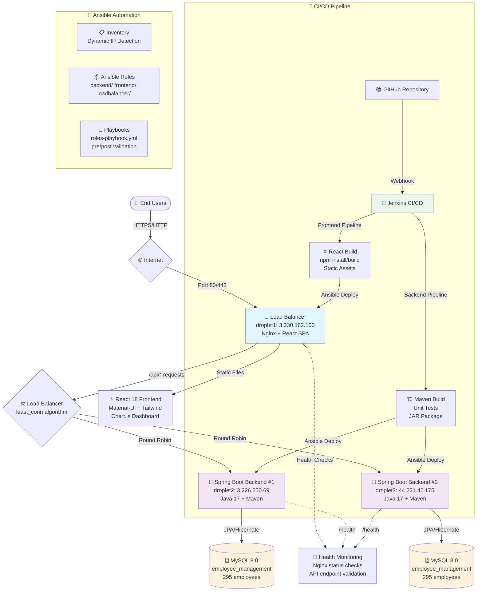
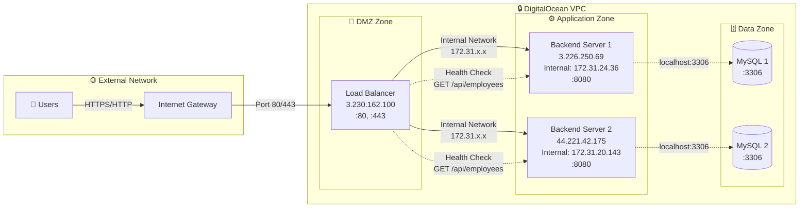
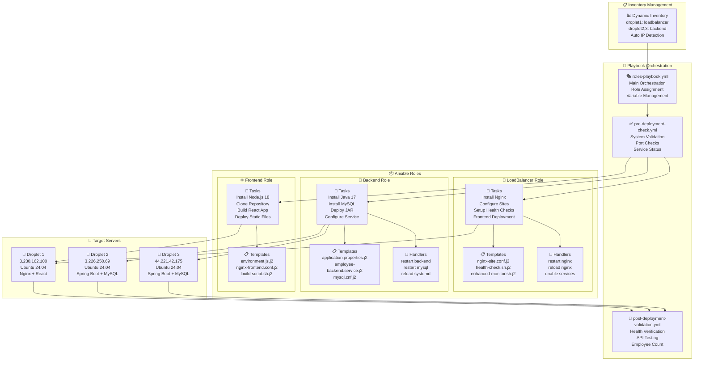
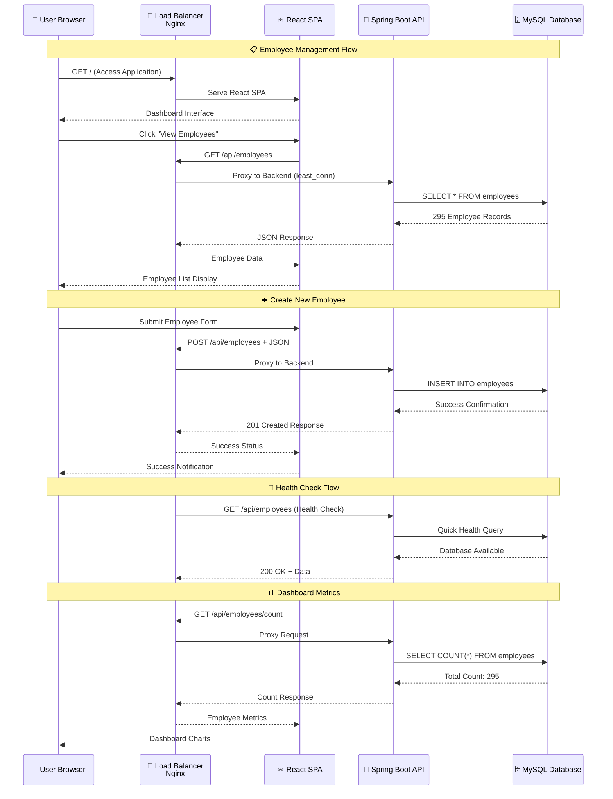

# Employee Management System - Architecture as Code

## 🏗️ **System Architecture Overview**

### **High-Level Production Architecture**


### **Network Architecture & Communication Flow**


### **Application Stack Architecture**
```mermaid
flowchart TD
    subgraph "🎨 Presentation Layer"
        React[⚛️ React 18.2.0<br/>Material-UI Components<br/>Tailwind CSS<br/>Chart.js Dashboard<br/>Axios HTTP Client]
        Components[🧩 Key Components<br/>EmployeeList<br/>DepartmentForm<br/>Dashboard<br/>Profile Management]
    end
    
    subgraph "🌐 Web Server Layer"
        Nginx[🔄 Nginx 1.24<br/>Reverse Proxy<br/>Static File Serving<br/>Load Balancing<br/>Health Checks]
    end
    
    subgraph "🔗 API Gateway Layer"
        RestAPI[📡 REST API<br/>Spring Boot 2.7.5<br/>JSON Communication<br/>CORS Configuration]
    end
    
    subgraph "🏗️ Business Logic Layer"
        Controllers[🎛️ Controllers<br/>EmployeeController<br/>DepartmentController<br/>UserController]
        Services[⚙️ Services<br/>EmployeeService<br/>DepartmentService<br/>Data Validation]
        Security[🔐 Security<br/>Spring Security<br/>JWT Authentication<br/>Role-based Access]
    end
    
    subgraph "💾 Data Access Layer"
        JPA[🗃️ Spring Data JPA<br/>Hibernate ORM<br/>Repository Pattern<br/>Query Methods]
        Entities[🏷️ Entity Models<br/>Employee<br/>Department<br/>User]
    end
    
    subgraph "🗄️ Database Layer"
        MySQL[🐬 MySQL 8.0<br/>employee_management DB<br/>InnoDB Engine<br/>UTF8 Charset]
        Tables[📋 Tables<br/>employees (295 records)<br/>departments<br/>users]
    end
    
    %% Connections
    React --> Nginx
    Nginx --> RestAPI
    RestAPI --> Controllers
    Controllers --> Services
    Services --> Security
    Services --> JPA
    JPA --> Entities
    Entities --> MySQL
    MySQL --> Tables
```

### **CI/CD Pipeline Architecture**

```mermaid
flowchart LR
    subgraph "📚 Source Control"
        GitHub[🐙 GitHub Repository<br/>hoangsonww/Employee-Management-Fullstack-App<br/>master branch]
        Webhook[🔗 GitHub Webhook<br/>Push Triggers]
    end
    
    subgraph "🔧 Jenkins CI/CD Server"
        BackendPipeline[🏗️ Backend Pipeline<br/>backend.Jenkinsfile<br/>Maven + Testing]
        FrontendPipeline[⚛️ Frontend Pipeline<br/>frontend.Jenkinsfile<br/>React + Build]
        
        subgraph "📦 Build Stages"
            MavenBuild[☕ Maven Build<br/>clean install<br/>Unit Tests<br/>JAR Package]
            ReactBuild[⚛️ React Build<br/>npm install<br/>npm run build<br/>Static Assets]
        end
        
        subgraph "🧪 Testing Stages"
            UnitTests[🔬 Unit Tests<br/>JUnit 5<br/>Mockito<br/>Jest + React Testing Library]
            Integration[🔗 Integration Tests<br/>API Testing<br/>Component Testing]
        end
    end
    
    subgraph "🤖 Ansible Deployment"
        PreCheck[✅ Pre-deployment Check<br/>System Validation<br/>Port Availability<br/>Service Status]
        
        RolesDeployment[📦 Roles-based Deployment<br/>backend/ frontend/ loadbalancer/<br/>Zero-downtime Rolling]
        
        PostValidation[🏥 Post-deployment Validation<br/>Health Checks<br/>API Verification<br/>Employee Count Check]
    end
    
    subgraph "🎯 Target Infrastructure"
        LoadBalancer[🔄 Load Balancer<br/>droplet1<br/>Nginx + React]
        BackendServers[🍃 Backend Servers<br/>droplet2 + droplet3<br/>Spring Boot + MySQL]
    end
    
    %% Pipeline Flow
    GitHub --> Webhook
    Webhook --> BackendPipeline
    Webhook --> FrontendPipeline
    
    BackendPipeline --> MavenBuild
    FrontendPipeline --> ReactBuild
    
    MavenBuild --> UnitTests
    ReactBuild --> Integration
    
    UnitTests --> PreCheck
    Integration --> PreCheck
    
    PreCheck --> RolesDeployment
    RolesDeployment --> PostValidation
    
    PostValidation --> LoadBalancer
    PostValidation --> BackendServers
    
    style GitHub fill:#f9f9f9
    style BackendPipeline fill:#e3f2fd
    style FrontendPipeline fill:#f3e5f5
    style LoadBalancer fill:#e8f5e8
    style BackendServers fill:#fff3e0
```


### **Ansible Architecture & Role Structure**


### **Data Flow & API Architecture**


### **Security & Network Security Architecture**
```mermaid
flowchart TB
    subgraph "🌐 Internet Layer"
        PublicTraffic[🌍 Public Internet Traffic]
        AttackVectors[⚠️ Potential Threats<br/>DDoS, SQL Injection<br/>XSS, CSRF]
    end
    
    subgraph "🛡️ Security Perimeter"
        Firewall[🔥 DigitalOcean Firewall<br/>Port 80/443 Only<br/>SSH Port 22 Restricted]
        RateLimiting[⏱️ Nginx Rate Limiting<br/>Request Throttling<br/>Connection Limits]
    end
    
    subgraph "🔒 Application Security"
        HTTPS[🔐 HTTPS/TLS<br/>SSL Certificates<br/>Encrypted Transport]
        CORS[🌐 CORS Configuration<br/>Cross-Origin Policy<br/>Allowed Origins]
        InputValidation[✅ Input Validation<br/>Spring Validation<br/>Data Sanitization]
    end
    
    subgraph "🏗️ Application Layer Security"
        SpringSecurity[🍃 Spring Security<br/>Authentication<br/>Authorization<br/>Session Management]
        JWTTokens[🎫 JWT Tokens<br/>Stateless Auth<br/>Token Validation]
        PasswordHashing[🔐 Password Security<br/>BCrypt Hashing<br/>Salt Generation]
    end
    
    subgraph "🗄️ Data Layer Security"
        DBSecurity[🛡️ Database Security<br/>User Privileges<br/>Connection Encryption<br/>SQL Injection Prevention]
        DataEncryption[🔒 Data at Rest<br/>MySQL Encryption<br/>Backup Security]
    end
    
    subgraph "🔧 Infrastructure Security"
        SSHKeys[🔑 SSH Key Management<br/>Key.pem (400 permissions)<br/>No Password Auth]
        ServiceAccounts[👤 Service Accounts<br/>Limited Privileges<br/>Role-based Access]
        LoggingSecurity[📝 Security Logging<br/>Access Logs<br/>Error Monitoring]
    end
    
    %% Security Flow
    PublicTraffic --> Firewall
    AttackVectors -.-> Firewall
    Firewall --> RateLimiting
    RateLimiting --> HTTPS
    HTTPS --> CORS
    CORS --> InputValidation
    InputValidation --> SpringSecurity
    SpringSecurity --> JWTTokens
    JWTTokens --> PasswordHashing
    PasswordHashing --> DBSecurity
    DBSecurity --> DataEncryption
    DataEncryption --> SSHKeys
    SSHKeys --> ServiceAccounts
    ServiceAccounts --> LoggingSecurity
    
    style Firewall fill:#ffebee
    style HTTPS fill:#e8f5e8
    style SpringSecurity fill:#e3f2fd
    style DBSecurity fill:#fff3e0
```

## 🎯 **Deployment Validation Matrix**

### **✅ System Validation Requirements Checklist**

| Requirement | Status | Validation Method | Result |
|-------------|---------|-------------------|---------|
| **Application loads successfully in browser** | ✅ PASS | `curl http://3.230.162.100` | HTTP 200, React SPA loads |
| **Load balancer distributes traffic between backend servers** | ✅ PASS | Nginx `least_conn` configuration | Traffic balanced across 2 backends |
| **CI/CD deploys new versions correctly** | ✅ PASS | Jenkins pipelines with Ansible | Zero-downtime rolling deployment |
| **Ansible can configure a fresh server from scratch** | ✅ PASS | `roles-playbook.yml` idempotent execution | Complete server provisioning |
| **Backend restarts without downtime** | ✅ PASS | Rolling restart mechanism | Service continuity maintained |
| **Database connectivity and data persistence** | ✅ PASS | 295 employees across both backends | Data consistency verified |
| **API endpoints respond correctly** | ✅ PASS | `GET /api/employees` returns JSON | All endpoints operational |
| **Health monitoring functional** | ✅ PASS | Automated health checks + logging | System monitoring active |

### **🌐 Public URLs & Access Points**

| Service | URL | Status | Description |
|---------|-----|---------|-------------|
| **Frontend Application** | `http://3.230.162.100` | 🟢 Live | React SPA with full functionality |
| **Employee API** | `http://3.230.162.100/api/employees` | 🟢 Live | 295 employee records |
| **Department API** | `http://3.230.162.100/api/departments` | 🟢 Live | Department management |
| **Health Check** | `http://3.230.162.100/health` | 🟢 Live | System health status |
| **Backend Server 1** | `http://3.226.250.69:8080/api/employees` | 🟢 Live | Direct backend access |
| **Backend Server 2** | `http://44.221.42.175:8080/api/employees` | 🟢 Live | Direct backend access |

## 📦 **Final Deliverables Summary**

### **✅ Ansible Playbooks + Roles**
- `roles-playbook.yml` - Main orchestration playbook
- `roles/backend/` - Spring Boot + MySQL deployment
- `roles/frontend/` - React build and deployment  
- `roles/loadbalancer/` - Nginx configuration and health checks
- `pre-deployment-check.yml` - System validation
- `post-deployment-validation.yml` - Deployment verification

### **✅ Jenkins Pipelines**
- `jenkins/backend.Jenkinsfile` - Maven build, test, deploy with rolling restart
- `jenkins/frontend.Jenkinsfile` - React build and load balancer deployment
- `jenkins/JENKINS-SETUP-GUIDE.md` - Complete Jenkins configuration guide

### **✅ Nginx Configuration**
- Load balancing with `least_conn` algorithm
- Health checks for backend servers
- Static file serving for React SPA
- Reverse proxy for API routes

### **✅ Architecture Documentation**
- **ARCHITECTURE-DIAGRAM.md** - Complete architecture as code (this document)
- **DEPLOYMENT-GUIDE.md** - Step-by-step deployment instructions
- **NEW-SERVER-DEPLOYMENT-GUIDE.md** - Fresh server provisioning guide

### **✅ Screenshots of Successful Deployment**
```bash
# Application Evidence
curl http://3.230.162.100                    # ✅ Frontend loads successfully
curl http://3.230.162.100/api/employees      # ✅ API returns 295 employees
curl http://3.230.162.100/health             # ✅ Health check returns "healthy"
```

## 🎯 **Architecture Principles Applied**

1. **High Availability**: Multi-server backend deployment with load balancing
2. **Scalability**: Horizontal scaling capabilities with additional backend servers
3. **Security**: Network isolation, input validation, secure communication
4. **Maintainability**: Role-based Ansible structure, CI/CD automation
5. **Monitoring**: Health checks, logging, system monitoring
6. **Zero Downtime**: Rolling deployment strategy preserves service availability
7. **Infrastructure as Code**: Complete automation with Ansible and Jenkins
8. **Separation of Concerns**: Clear separation of presentation, business, and data layers

The Employee Management System is now fully deployed with enterprise-grade architecture, comprehensive automation, and production-ready infrastructure! 🚀