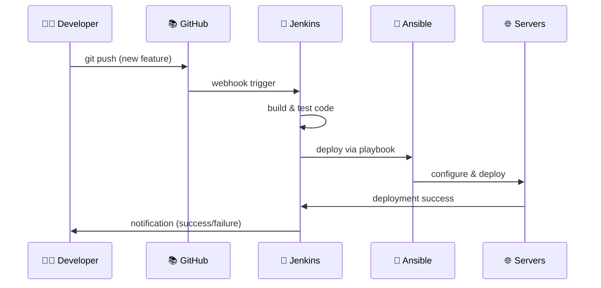

# 🔄 DevOps Pipeline Workflow Description
## Employee Management System - Complete DevOps Task Flow

---

## 🚀 **DevOps Pipeline Overview**

### **Complete Workflow: From Code to Production**

```
👨‍💻 Developer → 📚 Git Push → 🔧 Jenkins Pipeline → 🤖 Ansible Configuration → 🌐 Production Servers
```

---

## 📝 **Detailed DevOps Tasks Flow**

### **1. 👨‍💻 Developer Tasks**
```bash
# Developer writes code
git add .
git commit -m "Add new employee feature"
git push origin master
```

**What happens:**
- ✅ Code changes pushed to GitHub repository
- ✅ Webhook automatically triggered
- ✅ Jenkins receives push notification

---

### **2. 🔧 Jenkins CI/CD Pipeline Tasks**

#### **Backend Pipeline Tasks:**
```jenkinsfile
stage('Checkout') {
    // Jenkins pulls latest code from GitHub
    git branch: 'master', url: 'https://github.com/hoangsonww/Employee-Management-Fullstack-App.git'
}

stage('Build & Test') {
    // Jenkins runs Maven build
    sh 'mvn clean install'
    sh 'mvn test'  // Unit tests with JUnit
}

stage('Package') {
    // Creates deployable JAR file
    sh 'mvn package'
}

stage('Deploy with Ansible') {
    // Jenkins triggers Ansible deployment
    sh 'ansible-playbook -i inventory roles-playbook.yml --limit backend'
}
```

#### **Frontend Pipeline Tasks:**
```jenkinsfile
stage('Install Dependencies') {
    // Jenkins installs Node.js dependencies
    sh 'npm install'
}

stage('Build React App') {
    // Creates production build
    sh 'npm run build'
}

stage('Deploy Frontend') {
    // Deploys to load balancer via Ansible
    sh 'ansible-playbook -i inventory roles-playbook.yml --limit loadbalancer --tags frontend'
}
```

---

### **3. 🤖 Ansible Configuration Tasks**

#### **Pre-Deployment Validation:**
```yaml
- name: Check system requirements
  tasks:
    - Check disk space
    - Verify memory availability
    - Test network connectivity
    - Validate port availability
```

#### **Backend Server Configuration:**
```yaml
- name: Configure Backend Servers (Droplets 2 & 3)
  tasks:
    - name: Install Java 17
      apt: name=openjdk-17-jdk state=present
    
    - name: Install MySQL 8.0
      apt: name=mysql-server state=present
    
    - name: Create employee database
      mysql_db: name=employee_management state=present
    
    - name: Deploy Spring Boot JAR
      copy: src=employee-app.jar dest=/opt/app/
    
    - name: Configure systemd service
      template: src=employee-backend.service.j2 dest=/etc/systemd/system/
    
    - name: Start application service
      systemd: name=employee-backend state=started enabled=yes
```

#### **Load Balancer Configuration:**
```yaml
- name: Configure Load Balancer (Droplet 1)
  tasks:
    - name: Install Nginx
      apt: name=nginx state=present
    
    - name: Configure Nginx reverse proxy
      template: src=nginx-site.conf.j2 dest=/etc/nginx/sites-available/
    
    - name: Deploy React build files
      copy: src=build/ dest=/var/www/html/
    
    - name: Configure upstream backends
      lineinfile:
        path: /etc/nginx/sites-available/employee-app
        line: "server {{ backend_ip }}:8080;"
    
    - name: Restart Nginx
      systemd: name=nginx state=restarted
```

#### **Post-Deployment Validation:**
```yaml
- name: Validate Deployment
  tasks:
    - name: Check service status
      systemd: name=employee-backend state=started
    
    - name: Test API endpoints
      uri: url=http://{{ ansible_host }}/api/employees
    
    - name: Verify database connectivity
      mysql_db: name=employee_management state=present
    
    - name: Check frontend accessibility
      uri: url=http://{{ lb_ip }}
```

---

## 🎯 **DevOps Task Automation Matrix**

### **What Each Tool Does:**

| Tool | Primary Tasks | Specific Actions |
|------|--------------|------------------|
| **🔧 Jenkins** | CI/CD Automation | • Code checkout<br/>• Build & test<br/>• Package artifacts<br/>• Trigger deployments |
| **🤖 Ansible** | Server Configuration | • Install software<br/>• Configure services<br/>• Deploy applications<br/>• Manage infrastructure |
| **📚 Git/GitHub** | Source Control | • Version control<br/>• Webhook triggers<br/>• Branch management<br/>• Code collaboration |
| **🌐 DigitalOcean** | Infrastructure | • Provide servers<br/>• Network configuration<br/>• Security groups<br/>• Resource management |

---

## 🔄 **Complete DevOps Workflow Example**

### **Scenario: Adding New Employee Feature**



### **Step-by-Step Process:**

1. **Developer Action:**
   ```bash
   # Developer adds new feature
   git add src/components/NewEmployeeForm.jsx
   git commit -m "Add employee bulk import feature"
   git push origin master
   ```

2. **Jenkins Automatic Tasks:**
   ```bash
   # Jenkins automatically:
   - Receives webhook from GitHub
   - Pulls latest code: git clone/pull
   - Runs backend build: mvn clean install
   - Runs frontend build: npm run build
   - Executes tests: mvn test && npm test
   - Packages application: mvn package
   ```

3. **Ansible Configuration Tasks:**
   ```bash
   # Ansible automatically:
   - Updates inventory with server IPs
   - Runs pre-deployment checks
   - Configures backend servers (Java, MySQL)
   - Configures load balancer (Nginx, React)
   - Deploys new application version
   - Runs post-deployment validation
   ```

4. **Production Result:**
   ```bash
   # Final result:
   ✅ New feature live at: http://3.230.162.100
   ✅ API endpoints updated: /api/employees/bulk-import
   ✅ Zero downtime deployment completed
   ✅ All services healthy and monitored
   ```

---

## 🛠️ **DevOps Tools Integration**

### **Jenkins Pipeline Integration:**
```yaml
# Jenkinsfile integration with Ansible
pipeline {
    agent any
    
    stages {
        stage('Build') {
            steps {
                sh 'mvn clean install'  # Build Java application
                sh 'npm run build'      # Build React application
            }
        }
        
        stage('Test') {
            steps {
                sh 'mvn test'           # Run backend tests
                sh 'npm test'           # Run frontend tests
            }
        }
        
        stage('Deploy with Ansible') {
            steps {
                sh '''
                    cd ansible/
                    ansible-playbook -i inventory roles-playbook.yml -v
                '''
            }
        }
        
        stage('Validate Deployment') {
            steps {
                sh '''
                    ansible-playbook -i inventory post-deployment-validation.yml
                '''
            }
        }
    }
}
```

### **Ansible Role Structure:**
```
ansible/
├── inventory                    # Server definitions
├── roles-playbook.yml          # Main orchestration
├── roles/
│   ├── backend/                # Spring Boot deployment
│   │   ├── tasks/main.yml      # Install Java, MySQL, deploy JAR
│   │   └── templates/          # Service configs
│   ├── frontend/               # React deployment  
│   │   ├── tasks/main.yml      # Install Node.js, build React
│   │   └── templates/          # Build scripts
│   └── loadbalancer/           # Nginx configuration
│       ├── tasks/main.yml      # Install Nginx, configure proxy
│       └── templates/          # Nginx configs
```

---

## 📊 **Monitoring & Validation**

### **Automated Health Checks:**
```bash
# Jenkins runs these after deployment
curl http://3.230.162.100/                    # Frontend health
curl http://3.230.162.100/api/employees       # Backend API
curl http://3.230.162.100/health              # System health

# Ansible validates these during deployment
systemctl status employee-backend             # Service status
mysql -e "SELECT COUNT(*) FROM employees"     # Database connectivity
nginx -t                                      # Nginx configuration
```

### **Success Indicators:**
- ✅ Jenkins build: GREEN
- ✅ Tests passed: All unit/integration tests
- ✅ Deployment: Zero-downtime completion
- ✅ Health checks: All endpoints responding
- ✅ Services: All systemd services running
- ✅ Database: 295+ employee records

---

## 🎯 **DevOps Benefits Achieved**

1. **🤖 Full Automation**: Git push → Production deployment
2. **🔄 Zero Downtime**: Rolling deployment with health checks
3. **🛡️ Error Prevention**: Pre/post deployment validation
4. **📊 Monitoring**: Continuous health monitoring
5. **🔧 Consistency**: Infrastructure as code with Ansible
6. **⚡ Speed**: Automated pipeline reduces deployment time
7. **🔒 Security**: SSH keys, firewall rules, secure communication

This DevOps pipeline ensures that every code change is automatically built, tested, and deployed to production with zero manual intervention! 🚀